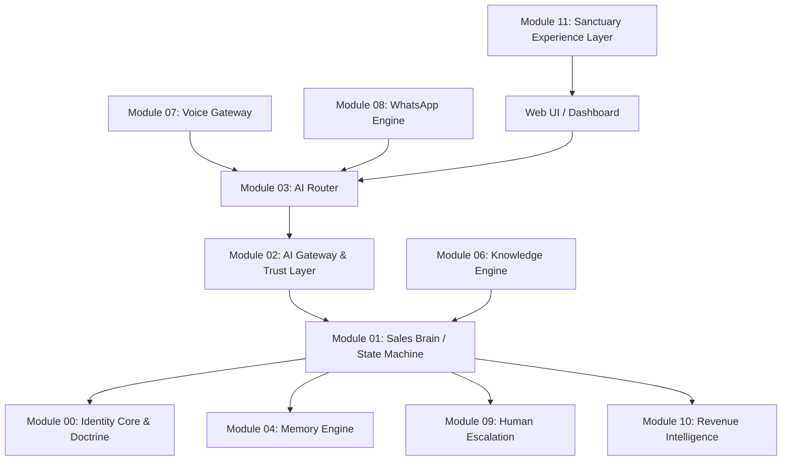

# 🔗 DEPENDENCY GRAPH: KRYPTON AI MODULES

Ce document définit les dépendances strictes entre les modules fonctionnels de Krypton AI, afin de garantir l'absence de régression.

## Hiérarchie des Dépendances OMEGA

## Règles d'Implémentation (Contrat d'Architecture)

1.  **Isolation des Canaux**: `M07 (Voice)`, `M08 (WhatsApp)`, et `WebUI` n'ont **aucune** connaissance métier. Ils collectent l'input et l'envoient aveuglément à `M03 (AI Router)`.
2.  **Centralité du Cerveau**: `M01 (Sales Brain)` est le seul module autorisé à modifier l'état d'une conversation (Discovery -> Qualification -> Closing).
3.  **Sanctuarisation de la Mémoire**: `M04 (Memory Engine)` est l'unique source de vérité. L'AI n'invente pas un contexte, elle le lit depuis M04.
4.  **Gateway Unique**: Toutes les requêtes vers les LLM (Gemini, etc.) passent **obligatoirement** par `M02 (AI Gateway)`.
